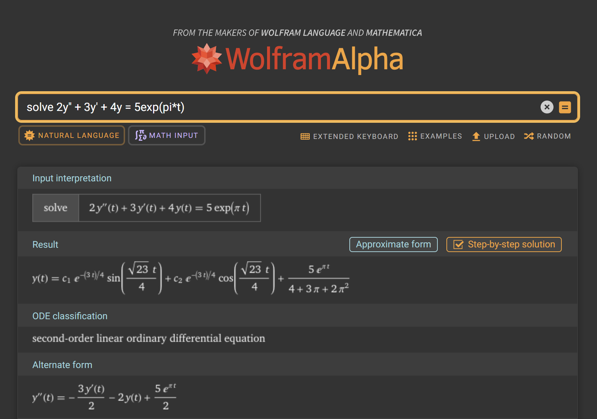

A very bad math lexer written scraped together in python in a few hours. 

Main purpose: to help me study for diff eq class due to constant latency issues WolframAlpha (probably just the school's internet...) 

The lexer itself is very scuffed, and the current `main.py` is far from useful. It's currently just set up to solve basic differential equations.
I'm not even sure if it will properly solve systems.

Essentially, it parses plaintext math format (like `2y'' + 3y' + 4y = 5exp(pi*t)`)
into a list of tokens, which it then lexes into more of an expression "tree" (still a list).
Once it's in this state it can pretty print in color and is free to be converted into other formats.
Currently it's set up to generate and eval sympy code to try and solve whatever expression it found:

The same expression in WolframAlpha:
